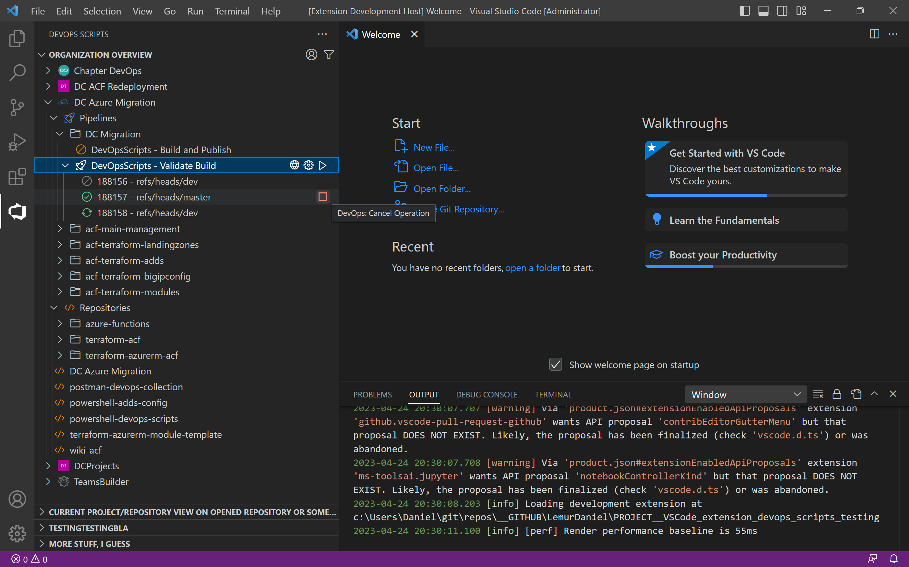

# devopsscripts README

private project for Testing VS Code Extension.

Mainly automating DevOps, automanaging repositories, downloading, creating Pull Requests, starting Pipelines, etc.

---

# Demo

Currently only supports treeview of Projects in Organization, but lots of stuff to come in the future.

